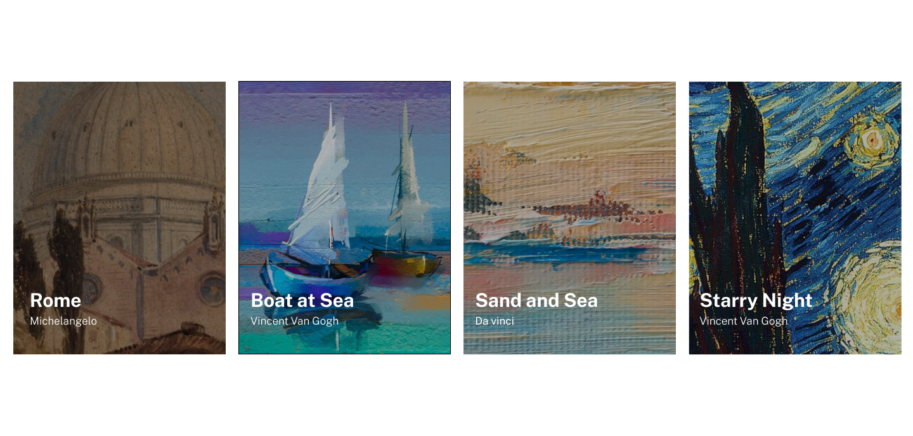

# Exercícios Flexbox
Aqui estão alguns exercícios que fiz sugeridos pelo curso DevQuest-Frontend, estruturados por HTML5 e estilizados com flexbox em CSS3...

Cartão de perfil
---

Gerador de conselhos

---

Lista de imagens - reponsivo

---

Manu - responsivo

---
