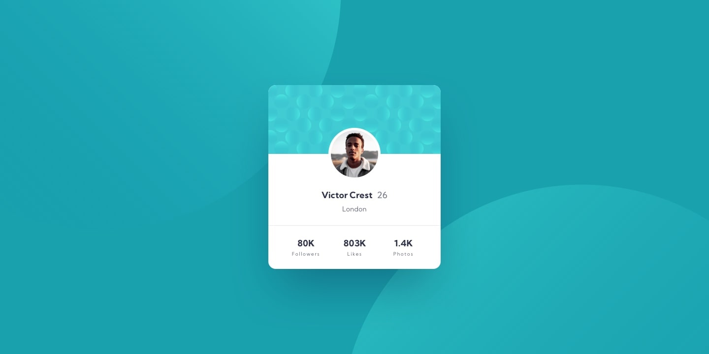

# Profile Card

Essa é a solução para o desafio Profile card component - Frontend Mentor

## Descrição
Construir o componente de perfil em um cartão e fazer com que pareça o mais próximo possível do design da imagem.

## Tecnologias utilizadas
- Semantica HTML
- Propriedades CSS
- Flexbox

## Cores

### Primário
Ciano escuro: hsl (185, 75%, 39%

Azul escuro: hsl (229, 23%, 23%)

Azul acinzentado escuro: hsl (227, 10%, 46%)

### Neutro
Cinza escuro: hsl (0, 0%, 59%)

## Tipografia

### Principal

- Tamanho da fonte: 18px

### Fonte
- Família: [Kumbh Sans](https://fonts.google.com/specimen/Kumbh+Sans)
- Pesos: 400, 700
